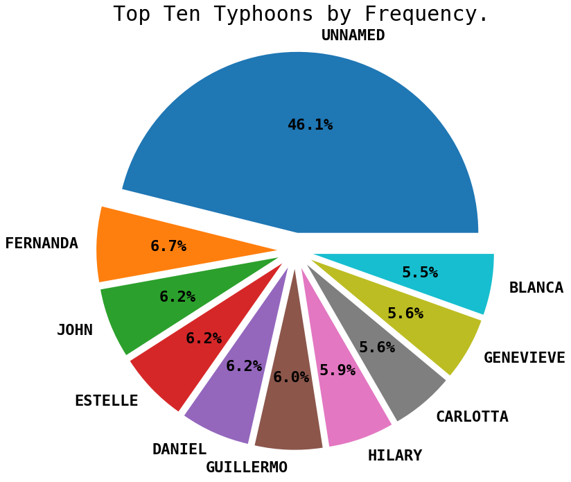

## Dataset 1:

- Link:  https://www.kaggle.com/noaa/hurricane-database

- Purpose:   I would use this dataset to try to predict the category of typhoons and the overall trend among eras.

---

## Dataset 2:

- Link:  https://www.kaggle.com/jacobbaruch/basketball-players-stats-per-season-49-leagues

- Purpose:  I would use this dataset to detect the basketball styles (scoring styles) among players or teams.

---

## Dataset 3:

- Link:  https://www.kaggle.com/cgurkan/airplane-crash-data-since-1908

- Purpose:  I would use this dataset to find which operators are the worst or which aircrafts model are the worst.

---

## Dataset 4:

- Link:  https://www.kaggle.com/artemkorottchenko/used-aircraft-pricing

- Purpose:   I would use this dataset to find what attributes influence the aircraft price obviously or slightly.

---

## Dataset 5:

- Link:  https://www.kaggle.com/aungpyaeap/fish-market

- Purpose:  I would use this dataset to try to predict the weight of a specific fish based on the species and several kind of lengths and widths


---

# Dataset information

## Chosen dataset: dataset 1(Hurricanes and Typhoons, 1851-2014)

To predict the category of typhoons, we retrieved a dataset from the Kaggle website that contains Pacific typhoon activities of 1949-2015, which is accorded into 26137 rows (Observations) and 22 columns (Variables)

---

### Status are defined as the following categories:
- TD – Tropical cyclone of tropical depression intensity (< 34 knots)
- TS – Tropical cyclone of tropical storm intensity (34-63 knots)
- HU – Tropical cyclone of hurricane intensity (> 64 knots)
- EX – Extratropical cyclone (of any intensity)
- SD – Subtropical cyclone of subtropical depression intensity (< 34 knots)
- SS – Subtropical cyclone of subtropical storm intensity (> 34 knots)
- LO – A low that is neither a tropical cyclone, a subtropical cyclone, nor an extratropical cyclone (of any intensity)
- WV – Tropical Wave (of any intensity)
- DB – Disturbance (of any intensity)


```python
import pandas as pd
import numpy as np
import matplotlib.pyplot as plt
import seaborn as sns
import re
import datetime as dt
import matplotlib.pyplot as plt
```


```python
# Ignore Warnings.
import warnings
warnings.filterwarnings("ignore")
```

### Data Cleaning and Preparation


```python
# Input data.
df = pd.read_csv('pacific.csv')
# Convert date column as datetime.
df['Date'] = pd.to_datetime(df['Date'] , format= '%Y%m%d')

# Create two columns that Latitude Hemisphere and Longitude Hemisphere with code 0 = N , 1 = S & 0 = E , 1 = W.
def hemisphere(coord):
        hem = re.findall(r'[NSWE]' , coord)[0]
        if hem == 'N' or hem == 'E':
            return 0
        else:
            return 1

# Creating the two columns.    
df['Latitude_Hemisphere'] = df['Latitude'].apply(hemisphere)
df['Longitude_Hemisphere'] = df['Longitude'].apply(hemisphere)
df['Latitude_Hemisphere'] = df['Latitude_Hemisphere'].astype('category')
df['Longitude_Hemisphere'] = df['Longitude_Hemisphere'].astype('category')

# Convert the latitude and longitude Column to numeric variable.
df['Latitude'] =  df['Latitude'].apply(lambda x: re.match('[0-9]{1,3}.[0-9]{0,1}' , x)[0])
df['Longitude'] =   df['Longitude'].apply(lambda x: re.match('[0-9]{1,3}.[0-9]{0,1}' , x)[0])

# The missing values are given by -999. So , we need to fill them appropriately.

# Count the missing values and replace them with mean.
for column in df.columns:
    missing_cnt = df[column][df[column] == -999].count()
    print('Missing Values in column {col} = '.format(col = column) , missing_cnt )
    if missing_cnt!= 0:
#         print('in ' , column)
        mean = round(df[column][df[column] != -999 ].mean())
#         print("mean",mean)
        index = df.loc[df[column] == -999 , column].index
#         print("index" , index )
        df.loc[df[column] == -999 , column] = mean
#         print(df.loc[index , column])
        
# Restructure the dataframe for visibility and remove ID and Event columns        
df =  df[['ID', 'Name', 'Date', 'Time', 'Event', 'Status', 'Latitude', 'Latitude_Hemisphere' , 
       'Longitude', 'Longitude_Hemisphere' ,'Maximum Wind', 'Minimum Pressure', 'Low Wind NE',
       'Low Wind SE', 'Low Wind SW', 'Low Wind NW', 'Moderate Wind NE',
       'Moderate Wind SE', 'Moderate Wind SW', 'Moderate Wind NW',
       'High Wind NE', 'High Wind SE', 'High Wind SW', 'High Wind NW']]

# Change time column to HHMM format.
df['Time'] = df['Time'].astype('object')
def hhmm(time):
    time = str(time)
    digits = re.findall(r'\d', time)
    t = ''
    if len(digits) == 1:
        t ='0{i}00'.format(i =time)
    elif len(digits) == 2:
        t = '{i}00'.format(i =time)
    elif len(digits) == 3:
        t = '0{i}'.format(i =time)
    else:
        t = time
    return t
# Convert the column into Datetime.
df['Time'] = df['Time'].apply(hhmm)
df['Time'] = pd.to_datetime(df['Time'] , format='%H%M').dt.time


# Convert the status column to categorical.
df['Status'] = df['Status'].astype('category')

data = df.drop(columns = ['ID' , 'Event'])
```

    Missing Values in column ID =  0
    Missing Values in column Name =  0
    Missing Values in column Date =  0
    Missing Values in column Time =  0
    Missing Values in column Event =  0
    Missing Values in column Status =  0
    Missing Values in column Latitude =  0
    Missing Values in column Longitude =  0
    Missing Values in column Maximum Wind =  0
    Missing Values in column Minimum Pressure =  12804
    Missing Values in column Low Wind NE =  19750
    Missing Values in column Low Wind SE =  19750
    Missing Values in column Low Wind SW =  19750
    Missing Values in column Low Wind NW =  19750
    Missing Values in column Moderate Wind NE =  19750
    Missing Values in column Moderate Wind SE =  19750
    Missing Values in column Moderate Wind SW =  19750
    Missing Values in column Moderate Wind NW =  19750
    Missing Values in column High Wind NE =  19750
    Missing Values in column High Wind SE =  19750
    Missing Values in column High Wind SW =  19750
    Missing Values in column High Wind NW =  19750
    Missing Values in column Latitude_Hemisphere =  0
    Missing Values in column Longitude_Hemisphere =  0
    

### Display the data


```python
data.head(10)
```


<div>
<style scoped>
    .dataframe tbody tr th:only-of-type {
        vertical-align: middle;
    }

    .dataframe tbody tr th {
        vertical-align: top;
    }

    .dataframe thead th {
        text-align: right;
    }
</style>
<table border="1" class="dataframe">
  <thead>
    <tr style="text-align: right;">
      <th></th>
      <th>Name</th>
      <th>Date</th>
      <th>Time</th>
      <th>Status</th>
      <th>Latitude</th>
      <th>Latitude_Hemisphere</th>
      <th>Longitude</th>
      <th>Longitude_Hemisphere</th>
      <th>Maximum Wind</th>
      <th>Minimum Pressure</th>
      <th>...</th>
      <th>Low Wind SW</th>
      <th>Low Wind NW</th>
      <th>Moderate Wind NE</th>
      <th>Moderate Wind SE</th>
      <th>Moderate Wind SW</th>
      <th>Moderate Wind NW</th>
      <th>High Wind NE</th>
      <th>High Wind SE</th>
      <th>High Wind SW</th>
      <th>High Wind NW</th>
    </tr>
  </thead>
  <tbody>
    <tr>
      <th>0</th>
      <td>UNNAMED</td>
      <td>1949-06-11</td>
      <td>00:00:00</td>
      <td>TS</td>
      <td>20.2</td>
      <td>0</td>
      <td>106.3</td>
      <td>1</td>
      <td>45</td>
      <td>995</td>
      <td>...</td>
      <td>27</td>
      <td>35</td>
      <td>13</td>
      <td>11</td>
      <td>9</td>
      <td>11</td>
      <td>5</td>
      <td>4</td>
      <td>3</td>
      <td>5</td>
    </tr>
    <tr>
      <th>1</th>
      <td>UNNAMED</td>
      <td>1949-06-11</td>
      <td>06:00:00</td>
      <td>TS</td>
      <td>20.2</td>
      <td>0</td>
      <td>106.4</td>
      <td>1</td>
      <td>45</td>
      <td>995</td>
      <td>...</td>
      <td>27</td>
      <td>35</td>
      <td>13</td>
      <td>11</td>
      <td>9</td>
      <td>11</td>
      <td>5</td>
      <td>4</td>
      <td>3</td>
      <td>5</td>
    </tr>
    <tr>
      <th>2</th>
      <td>UNNAMED</td>
      <td>1949-06-11</td>
      <td>12:00:00</td>
      <td>TS</td>
      <td>20.2</td>
      <td>0</td>
      <td>106.7</td>
      <td>1</td>
      <td>45</td>
      <td>995</td>
      <td>...</td>
      <td>27</td>
      <td>35</td>
      <td>13</td>
      <td>11</td>
      <td>9</td>
      <td>11</td>
      <td>5</td>
      <td>4</td>
      <td>3</td>
      <td>5</td>
    </tr>
    <tr>
      <th>3</th>
      <td>UNNAMED</td>
      <td>1949-06-11</td>
      <td>18:00:00</td>
      <td>TS</td>
      <td>20.3</td>
      <td>0</td>
      <td>107.7</td>
      <td>1</td>
      <td>45</td>
      <td>995</td>
      <td>...</td>
      <td>27</td>
      <td>35</td>
      <td>13</td>
      <td>11</td>
      <td>9</td>
      <td>11</td>
      <td>5</td>
      <td>4</td>
      <td>3</td>
      <td>5</td>
    </tr>
    <tr>
      <th>4</th>
      <td>UNNAMED</td>
      <td>1949-06-12</td>
      <td>00:00:00</td>
      <td>TS</td>
      <td>20.4</td>
      <td>0</td>
      <td>108.6</td>
      <td>1</td>
      <td>45</td>
      <td>995</td>
      <td>...</td>
      <td>27</td>
      <td>35</td>
      <td>13</td>
      <td>11</td>
      <td>9</td>
      <td>11</td>
      <td>5</td>
      <td>4</td>
      <td>3</td>
      <td>5</td>
    </tr>
    <tr>
      <th>5</th>
      <td>UNNAMED</td>
      <td>1949-06-12</td>
      <td>06:00:00</td>
      <td>TS</td>
      <td>20.5</td>
      <td>0</td>
      <td>109.4</td>
      <td>1</td>
      <td>45</td>
      <td>995</td>
      <td>...</td>
      <td>27</td>
      <td>35</td>
      <td>13</td>
      <td>11</td>
      <td>9</td>
      <td>11</td>
      <td>5</td>
      <td>4</td>
      <td>3</td>
      <td>5</td>
    </tr>
    <tr>
      <th>6</th>
      <td>UNNAMED</td>
      <td>1949-06-12</td>
      <td>12:00:00</td>
      <td>TS</td>
      <td>20.6</td>
      <td>0</td>
      <td>110.2</td>
      <td>1</td>
      <td>45</td>
      <td>995</td>
      <td>...</td>
      <td>27</td>
      <td>35</td>
      <td>13</td>
      <td>11</td>
      <td>9</td>
      <td>11</td>
      <td>5</td>
      <td>4</td>
      <td>3</td>
      <td>5</td>
    </tr>
    <tr>
      <th>7</th>
      <td>UNNAMED</td>
      <td>1949-06-17</td>
      <td>12:00:00</td>
      <td>TS</td>
      <td>14.1</td>
      <td>0</td>
      <td>107.0</td>
      <td>1</td>
      <td>45</td>
      <td>995</td>
      <td>...</td>
      <td>27</td>
      <td>35</td>
      <td>13</td>
      <td>11</td>
      <td>9</td>
      <td>11</td>
      <td>5</td>
      <td>4</td>
      <td>3</td>
      <td>5</td>
    </tr>
    <tr>
      <th>8</th>
      <td>UNNAMED</td>
      <td>1949-06-17</td>
      <td>18:00:00</td>
      <td>TS</td>
      <td>14.6</td>
      <td>0</td>
      <td>107.7</td>
      <td>1</td>
      <td>45</td>
      <td>995</td>
      <td>...</td>
      <td>27</td>
      <td>35</td>
      <td>13</td>
      <td>11</td>
      <td>9</td>
      <td>11</td>
      <td>5</td>
      <td>4</td>
      <td>3</td>
      <td>5</td>
    </tr>
    <tr>
      <th>9</th>
      <td>UNNAMED</td>
      <td>1949-06-18</td>
      <td>00:00:00</td>
      <td>TS</td>
      <td>15.0</td>
      <td>0</td>
      <td>108.4</td>
      <td>1</td>
      <td>45</td>
      <td>995</td>
      <td>...</td>
      <td>27</td>
      <td>35</td>
      <td>13</td>
      <td>11</td>
      <td>9</td>
      <td>11</td>
      <td>5</td>
      <td>4</td>
      <td>3</td>
      <td>5</td>
    </tr>
  </tbody>
</table>
<p>10 rows × 22 columns</p>
</div>


```python
# Find the top ten typhoons which have occured the maximum number of times.
lst = [x.strip() for x in data.groupby('Name').count().sort_values(by = 'Date' , ascending = False).index[:10]]
val = data.groupby('Name').count().sort_values(by = 'Date' , ascending = False)[:10]['Date'].values
font = {'family' : 'monospace',
        'weight' : 'bold',
        'size'   : 22}
plt.rc('font', **font)
fig , ax = plt.subplots()
fig.set_size_inches(12,12)
ax.pie(  labels = lst , x = val , autopct='%.1f%%' , explode = [0.1 for x in range(10)])
plt.title(' Top Ten Typhoons by Frequency.' , fontsize = 30)
plt.show()
```





```python
# Plot the Frequency of Typhoons(obervations) by Month.
data['Month'] = data['Date'].apply(lambda x: x.month)
data['Year'] = data['Date'].apply(lambda x: x.year)
mnt = ['Jan' , 'Feb' , 'Mar' , 'Apr' , 'May' , 'June' , 'July' , 'Aug' , 'Sep','Oct' , 'Nov' , 'Dec']
temp = data.groupby('Month').count()
temp.loc[4] = 0
temp = temp.sort_values(by = 'Month' , ascending = False)
font = {'family' : 'monospace',
        'weight' : 'bold',
        'size'   : 22}
plt.rc('font', **font)
plt.figure(figsize = (10,10))
sns.set_style("whitegrid")
ax = sns.barplot(x = temp.index , y = 'Date' , data=temp , palette = 'RdBu' )
plt.xticks([0,1,2,3,4,5,6,7,8,9,10,11] , mnt , rotation = 90)
plt.ylabel('Frequency')
plt.title('Frequency of Typhoons(obervations) by Month.')
```


    Text(0.5, 1.0, 'Frequency of Typhoons(obervations) by Month.')


```python
# Plot the Year Wise Frequency of Typhoons(obervations).
temp = data.groupby('Year').count().sort_values(by = 'Month' , ascending = False)
plt.figure(figsize= (12,12))
sns.lineplot(x = temp.index , y = 'Month' , data = temp , label = 'Frequency')
plt.ylabel('Frequency')
plt.title('Year Wise Frequency of Typhoons(obervations)')
plt.show()
```


```python
# Plot the Probability Distribution of Frequency of Typhoons(observations).
temp = data.groupby('Year').count().sort_values(by = 'Date' , ascending = False)
plt.figure(figsize=(15,15))
sns.distplot(temp['Date'].values , norm_hist = True , axlabel = 'Probability Distribution of Frequency of Typhoons(observations)')
```


    <AxesSubplot:xlabel='Probability Distribution of Frequency of Typhoons(observations)'>


```python
#Plot the Category wise Frequency Distribution of Typhoon(observations)
temp = data.groupby('Status').count().sort_values(by = 'Date' , ascending = False)
fig , ax = plt.subplots()
fig.set_size_inches(12,12)
sns.barplot(y = list(temp.index) , x = 'Date' , data = temp, palette= 'pastel' )
plt.xlabel('Frequency')
plt.ylabel('Catehory')
plt.title('Category wise Frequency Distribution of Typhoon(observations).')
plt.show()
```


```python

```
